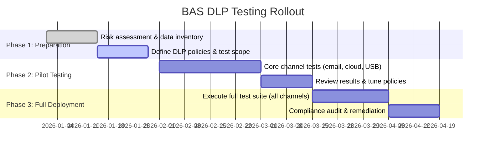

# DLP Exfiltration Testing for Compliance

**Executive Summary:**  Compliance frameworks (GDPR, HIPAA, PCI-DSS, etc.) require robust controls on sensitive data and periodic proof of their effectiveness.  In practice this means simulating realistic data-exfiltration attacks across all major channels and verifying the DLP solution catches them.  Key exfiltration vectors include **email** (attachments or inline PII), **web uploads**/cloud apps (HTTP(S) or API uploads to Dropbox, OneDrive, etc.), **removable media** (USB drives), **printing/PDF** exports, **messaging apps** (Slack, Teams, etc.), **DNS and protocol tunneling**, **covert channels** (steganography, TEMPEST), and direct device-to-device transfers.  Breach-and-attack simulations should exercise each channel with multiple methods: content-based tests (known sensitive patterns), contextual tests (atypical workflows), encryption/obfuscation tests (zipped/encrypted data), protocol-tunneling (DNS, ICMP, non-standard ports) and steganography tests.  NIST SP 800-53 explicitly calls for “exfiltration tests” to ensure no data escapes, and GDPR Article 32 mandates regular testing of security measures.  We recommend at least **3–6 distinct test cases per channel** (more for high-risk data), covering both insider-style (user copying data out) and external/scripted scenarios.  Success is defined as the DLP policy reliably detecting or blocking the test data (logging an alert or prevention event).  For audit evidence, collect DLP **policy exports**, **alert/event logs**, **incident tickets** or analyst notes, and screenshots of blocks. 

## Exfiltration Channels and Test Scenarios

A “complete” DLP validation covers **all major channels** and techniques.  The table below summarizes each channel, representative test types, example minimum test counts (per data classification level), and key regulations that rely on those controls.  (Actual counts depend on risk; the table shows a baseline recommendation.  High-risk data/tests should be multiplied accordingly.)

| **Channel**            | **Key Test Types / Variations**                                                                                              | **Min Test Cases** | **Relevant Compliance Areas**      |
|------------------------|-----------------------------------------------------------------------------------------------------------------------------|--------------------|-----------------------------------|
| **Email (Corp/Web)**   | Attachments and inline data with PII/PHI; multiple file types; encrypted or zipped files; steganographic images; bulk sends. External vs internal recipients. | 5–8 per data type | GDPR Art. 32; HIPAA Security; PCI-DSS Req 11; NIST SC-7；ISO 27001 A.13.2, A.18.1.3 |
| **Web Upload**         | HTTP(S) POST to web forms or personal cloud sites; browser-based copy/paste;  file sharing sites.  Test with hidden fields, encrypted content, script automated upload. | 4–6 | GDPR; PCI-DSS; ISO A.13.1; NIST SC-7 |
| **Cloud Storage (API)**| Upload via SaaS APIs (e.g. S3, Google Drive, Slack API); use official clients vs direct REST; with encryption, multiple file parts, renamed/corrupted files.  | 3–5 | GDPR; HIPAA; PCI; SOX (financial documents) |
| **Removable Media**    | Copy sensitive files to USB/SD cards (encrypted and unencrypted); auto-run programs; alternate files (hidden folders, alternate data streams); also test CD/DVD. | 3–5 | HIPAA; ISO 27001 A.8.3; NIST MP-5 (media sanitization) |
| **Printing / PDF**     | Print to PDF or network printer containing sensitive text/graphics; optical scan reads; fax/email.  Test scanning via OCR or photographing printed output for exfiltration. | 2–4 | HIPAA; SOX (financial reports); ISO A.9 (access); A.13.2 |
| **Messaging Apps**     | Send files/text via Slack/Teams/WhatsApp/etc.; copy/paste into chats; API sends.  Include screenshot sharing and paste of structured data. | 3–4 | GDPR; ISO A.13.2; NIST AC-17 (remote access) |
| **APIs (other)**       | Use other service APIs (GitHub, Salesforce) to exfiltrate sensitive records; test with encryption or protocol blending. | 2–3 | ISO 27001 A.13; NIST SC-7; GDPR |
| **DNS/Protocol Tunneling** | Encode data in DNS queries, ICMP, SMTP, or custom C2 channels (HTTP, WebSockets) to exfiltrate.  Test with small packets (low-and-slow) and large bursts. | 2–3 | NIST SC-7; ISO 27001 A.12.2; PCI Req 4 (encrypt); HIPAA (encrypt) |
| **Covert Channels**    | Hide data via steganography (images, audio); electromagnetic (TEMPEST) or acoustic (ultrasonic) channels. Test with known stego tools, audio beacons. | 1–2 | NIST SC-7; ISO A.12; CIS Controls #18 (influence) |
| **Endpoint-to-Endpoint** | Direct file transfers via Bluetooth, AirDrop, P2P apps, or Wi-Fi; test unauthorized sharing between PCs (file share, terminal send). | 2–3 | ISO A.11 (physical security); ISO A.6 (internal threats) |

Each “Min Test Cases” entry is a guideline for **distinct scenarios**.  For example, under *Email* one should test at least:
- sending an unencrypted document containing regulated data to an external address,
- sending via a webmail interface,
- sending a password-protected ZIP or encrypted attachment,
- sending data hidden in an image or spreadsheet (steganography),
- sending a benign-looking subject/context vs obviously sensitive (contextual test).
Success means **no regulated data passes undetected** – e.g. the DLP rules trigger a block or alert and record the incident.  Failure is if sensitive content reaches the target or the DLP misses it.  In all cases auditors expect comprehensive evidence: exported DLP policy rules, logs of each blocked transfer, SIEM or email server logs showing the attempt, ticketing or analyst notes on the test, and any screenshots of alerts.  (Screenshots alone are insufficient; the policy/log artifacts tie the test to the outcome.)

## Success Criteria and Evidence

- **Test Criteria:** A test **passes** if the DLP solution generates an alert or blocks the exfiltration in accordance with the defined policy.  Policies should classify the test data as sensitive and enforce the proper action (block/quarantine vs. log-only) depending on severity. A test **fails** if the sensitive data leaves the system undetected or without the expected action.  All alerts and actions must be documented.
- **Evidence for Auditors:** Provide comprehensive artifacts for each test:
  - **Policy Exports:** The DLP rule/configuration governing the channel and data type.
  - **Activity Logs:** DLP event logs or SIEM records showing the test transaction, matched content, and policy decision.
  - **Alert Reports:** Screenshots or reports of the DLP alert in the console or email gateway logs.
  - **Test Documentation:** A brief description of each test case, including date/time, user/account used, and observed result.
  - **Incident Tickets/Notes:** Any analyst investigation or business approval records, if applicable.
  
These items align with audit best practices: auditors look for policy definitions, a history of alerts/incidents, and proof that violations were handled or blocked. In short, don’t rely on screenshots alone – tie each test case to the system records.

## Regulatory Mapping

Each framework imposes its own requirements that justify exhaustive exfiltration testing:

- **GDPR (EU):**  Article 32 requires controllers to implement “appropriate technical measures” *and* “regularly testing, assessing and evaluating the effectiveness of technical and organisational measures”.  In practice, GDPR mandates proving that personal data cannot be exfiltrated.  Effective DLP testing directly demonstrates compliance with Art.32’s security obligations.
- **HIPAA (USA):**  The Security Rule (§164.308(a)(8)) demands a “periodic technical and non-technical evaluation” of safeguards.  Covered entities must regularly test their controls (administrative, physical, and technical) to protect ePHI. DLP exfiltration tests count as technical evaluations of data confidentiality controls.
- **PCI-DSS:**  Requirement 11.3 calls for penetration testing of the cardholder-data environment, and many QSAs interpret periodic DLP validation as part of testing.  In particular, PCI requires that CHD be encrypted and access-limited – meaning egress of CHD via email, USB, etc. must be tested.  The PCI DSS Guide notes that “DLP tools…required by PCI DSS Requirement 11” help “validate the efficacy of data protection methods”.  Regular DLP simulation aligns with PCI’s mandate to test all security controls on CHD.
- **SOX (404):**  Sarbanes-Oxley requires management and external auditors to verify internal controls over financial reporting.  While not explicit about DLP, any exfiltration of financial data would breach SOX.  Therefore testing egress channels (especially those handling financial records) supports SOX compliance by ensuring controls are effective.
- **NIST SP 800-53/800-171:**  Revision 5 includes Control SC-7(10) “Prevent Exfiltration” which states: “Conduct exfiltration tests [frequency]”.  Similarly, NIST SP 800-171 (for CUI) inherits SC-7’s requirements.  These controls explicitly require testing that unauthorized data flow is blocked.  Other relevant controls include SI-4 (Info System Monitoring) and MP-4/MP-5 (media protection). 
- **ISO/IEC 27001:**  Annex A (e.g. A.12.4 Logging, A.12.6 Technical Vulnerability Mgmt, A.18.1 Compliance) mandate monitoring and review of controls.  While ISO 27001 does not list specific test cases, auditors will want to see evidence of periodic testing of data security.  In practice, demonstrating that data exfiltration paths have been tested and blocked addresses the standard’s requirement for technical audits and reviews.

The table below highlights this mapping:

| **Framework**     | **Key Controls/Req’t**                           | **DLP Exfiltration Implication**                                    |
|-------------------|--------------------------------------------------|---------------------------------------------------------------------|
| GDPR (Art. 32)    | Regular testing of security measures  | Must *test* data security (e.g. DLP) to prove personal data is protected. |
| HIPAA Sec. Rule   | Periodic security evaluation         | Requires testing technical safeguards (DLP tests qualify).            |
| PCI-DSS           | Req 11 (test sec. systems); 3.4 (encrypt CHD) | Test that CHD cannot leave via unencrypted channels (email, USB, etc.). |
| SOX 404           | ICFR for financial data                            | Validate controls on financial data flow – implicitly include DLP tests. |
| NIST 800-53 SC-7(10) | “Prevent exfiltration” – “Conduct exfiltration tests” | Explicitly mandates simulating data theft scenarios.                   |
| NIST 800-171      | Derived from SC-7, MP-5 (media export)            | Similar requirement to test data flow controls.                      |
| ISO 27001 Annex A | A.12.4 (logging), A.12.6 (vuln mgmt), A.18.2 (reviews) | Auditors expect documented testing of data leakage controls.         |

## Risk Profiling and Test Prioritization

No one-size-fits-all number of tests can be prescribed without context.  We recommend a **risk-based approach**: 

- **High Risk (e.g. PHI, PCI):**  Assume *all* channels could be targeted.  Deploy the full suite of tests above (content, encryption, stego, tunneling) with multiple variations.  For high-sensitivity data, each channel might need 5–10 test cases (e.g. different file formats and obfuscation techniques).
- **Medium Risk:**  Focus on the most likely channels (email, cloud storage, USB, web upload).  Include at least 3–5 tests per channel, covering both plaintext and one obfuscated scenario.  
- **Low Risk (non-sensitive PII or internal data):**  Basic coverage is acceptable: test major channels once or twice with overt sensitive content.  Even here, include at least one steganography or encrypted-file test to ensure no obvious bypass.

**Prioritization Roadmap:**  Begin with the channels handling the bulk of regulated data.  For example, pilot tests on email and corporate cloud (most common exfiltration paths), then expand to endpoints (USB/printing) and covert channels.  Iterate based on findings: if a test uncovers a gap (e.g. files on personal cloud bypass detection), prioritize that channel for additional cases.

In this rollout, **Phase 1** establishes scope (identify data classes, select channels) and readies the BAS platform. **Phase 2** performs an initial wave of simulations on critical channels, refines policies, and addresses any misconfigurations. **Phase 3** executes the comprehensive test plan and gathers audit-ready evidence. All along, align test cases with specific compliance controls (e.g. “test encrypted email” to satisfy PCI Req 4 or HIPAA encryption requirements; “test DNS tunneling” to satisfy NIST SC-7(10) techniques).

## Checklist and Recommendations

- **Define Regulated Data Types:** Classify data (PII, PHI, CHD, etc.) and note which regulations apply (GDPR, HIPAA, etc.).  Use data classification to focus tests on high-value content.
- **Enumerate Channels and Scenarios:** Make a master list of exfil vectors in your environment (email systems, cloud apps, removable media policies, etc.).  For each, list test methods (see table above) and assign a minimum set of cases.
- **Develop Test Scripts/Tooling:** Automate repetitive tests (e.g. DNS tunneling tools, email scripts, USB copy scripts).  Include both **automated** attacks (malware-like exfil, scripted uploads) and **manual** scenarios (insider copying files).
- **Document Success Criteria:** Decide in advance what constitutes a “pass” for each test (typically, DLP must flag it).  Configure DLP rules accordingly, and ensure logging is enabled for all actions.
- **Collect Evidence:** As you run each test, immediately capture DLP console logs, screenshots of alerts, and any system logs. Maintain a test logbook linking each test ID to its outcomes.
- **Remediate and Retest:** For any test that **fails** (data got out), adjust DLP policies or network controls and rerun.  Track these until all desired cases succeed.
- **Map to Audit Controls:** For each test, note which compliance requirement it addresses. For example, “Test: Send PHI to personal email” ⇒ GDPR Art.32/HIPAA Security. Keep this mapping for auditors.
- **Periodic Repeat:** Finally, schedule these tests at least annually or whenever there is a major change (new system or policy) to satisfy the “regular testing” clauses of the regulations.

**Concise Recommendations:** Cover *every* channel where regulated data could exit. For thoroughness, include at least one test of each attack technique (encryption, steganography, covert channels) per channel. Always document the test plans and outcomes as audit evidence. Prioritize by risk: start with the channels housing the highest volumes of sensitive data (email, cloud) and proceed to less-likely paths. Leverage official guidance: NIST SP 800-53/171, ISO 27001/27002, GDPR Article 32 guidance, HIPAA Security Rule interpretative guidance, and vendor DLP best-practices documents. Vendor BAS/DLP resources (e.g. Picus or Cymulate) can be useful to benchmark test cases. Ultimately, when audit time comes, the organization should be able to point to a **matrix of tests vs. channels** showing 100% coverage of the relevant data flows, with logged evidence for each.

## Suggested Reference Materials

- **NIST SP 800-53 Rev. 5** (Control SC-7(10), SI-7, etc.) and **SP 800-171 Rev.3** – standards on information flow and exfiltration testing.  
- **NIST SP 800-115** (Technical Guide to Information Security Testing) – for methodologies on attack simulation.  
- **ISO/IEC 27001** and **27002** – Annex A controls on communications security and testing requirements.  
- **GDPR (Reg. 2016/679)** – especially Article 32 (Security of processing) requiring testing.  ICO guidance on security demonstrates a testing requirement.  
- **HIPAA Security Rule** – 45 CFR §164.308(a)(8) (“Evaluation”) requires periodic assessment of technical safeguards. HHS guidance notes regular evaluation of controls.  
- **PCI-DSS v3.2/4.0** – particularly Req 11 (test security systems) and Req 3–4 (protect CHD).  QSAs often expect DLP validation as part of card data environment testing.  
- **Vendor DLP/BAS Documentation** – such as Picus DLP testing modules, Cypress Cyberhaven posts, and academic papers on data exfiltration methods (e.g. MITRE ATT&CK Tactic TA0010).  These can offer concrete test scenarios.  
- **CIS Controls v8** – Control 13.6/3.13 recommends DLP deployment and testing of data protections. 

By synthesizing these sources and the table above, an organization can justify that “no additional tests are needed for compliance” once it has systematically covered each channel with the prescribed minimum scenarios.  In effect, a signed-off **DLP Testing Matrix** (channel × test) becomes the compliance proof that all regulated data paths have been exercised and secured. 

**Sources:** Authoritative guides and standards (GDPR Art.32; HIPAA Security Rule; PCI-DSS) and industry best practices (NIST SC-7(10) control; vendor/BAS whitepapers) were used to derive the above recommendations. These should be reviewed alongside each organization’s specific risk assessment and compliance obligations.