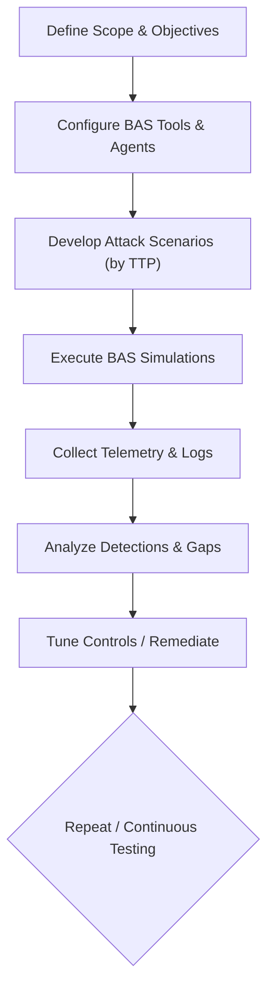
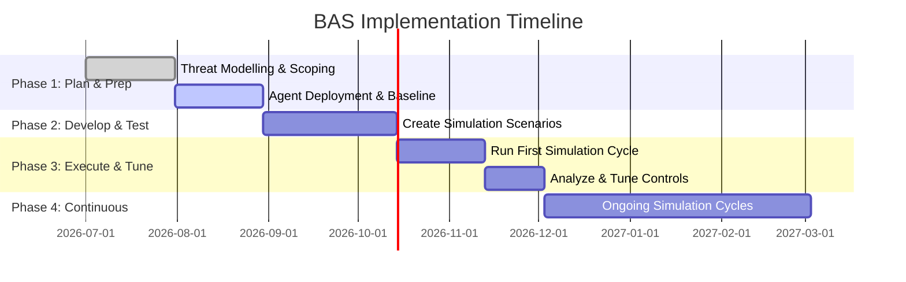

# Executive Summary  
Breach-and-Attack Simulation (BAS) platforms continuously and safely replicate real adversary TTPs against an organization’s endpoints to validate defenses.  This controlled testing runs on dedicated agents with automatic rollbacks to avoid disruption.  A comprehensive BAS will cover the common Windows, macOS, and Linux techniques defined in MITRE ATT&CK and used by threat groups.  For example, spearphishing with malicious attachments (T1566.001) is a cross-platform initial-access vector, while Windows-specific TTPs include PowerShell execution (T1059.001) and registry-run keys for persistence.  The BAS tests are designed so that success is determined by whether the EDR/AV/controls detect or block the simulated activity.  We gather telemetry from endpoints (process, network, file, registry events) and security systems to confirm detection of each TTP.  In short, BAS measures control effectiveness (detection/prevention) and exposes gaps. 

# 1. Endpoint TTP Inventory & MITRE Mapping  
Windows: Priority techniques include Execution (PowerShell T1059.001, Cmd T1059.003, scripting), Persistence (Startup/Registry Run Keys T1547.001, Services, Scheduled Tasks), Privilege Escalation (UAC Bypass T1548.002, exploits), Defense Evasion (Obfuscated Scripts T1027, DLL search-order hijacking), Credential Access (LSASS dumping T1003.001, hash harvesting), Discovery (Netstat, AD queries), Lateral Movement (PsExec/SMB T1021.002, Remote Services T1021.001), and C2 Channels (HTTP/S T1071.001, DNS).  These are used by groups like APT28/29 and ransomware gangs; e.g. MITRE notes APT29 added registry Run keys for persistence and used PowerShell scripts for remote tasks and payload download.  

macOS: Key endpoint techniques include AppleScript and Unix shell execution (T1059.002/T1059.004), LaunchAgents and Login Items for persistence, cron/launchctl jobs (T1053.005/T1053.006), Code Signing Bypass, and manipulation of SSH keys (T1098.004).  macOS also suffers from phishing and file-based malware (e.g. macOS ASR) similarly to Windows. 

Linux: Common TTPs include Unix Shell execution (T1059.004), package or script exploits (T1203), cron jobs (T1053.005), sudo exploitation (T1548.003), SSH key modification (T1098.004), and in-memory attacks via Bash or Python interpreters.  Linux endpoints are targeted by nation-states and ransomware (e.g. Xbash using Bash scripting). 

These TTPs map directly to MITRE ATT&CK techniques for each OS.  In all cases, we prioritize scenarios that adversary intel and risk analysis show are most likely (e.g. phishing, malware execution, credential dumping).  (For brevity the above is a sample of top TTPs; a full list would enumerate all relevant techniques from the MITRE Windows, macOS, and Linux matrices.)  

# 2. BAS Test Types, Preconditions, and Criteria  
For each TTP we define a test type (Simulation vs. Emulation vs. Safe Exploit), preconditions, and pass/fail criteria.  In general:  
- Simulation (Safe Stimulation): Execute benign or null payloads that mimic behavior (e.g. launch a harmless script instead of real malware).  Example: to test PowerShell execution, run a benign PowerShell command or script.  Preconditions: User/process context with ability to run scripts.  Success: EDR or AV flags the command execution (alerts or logs); Failure: no detection.  
- Emulation: Deploy sanitized or publicly known malware variants (without payload) or C2 beacons.  Example: launch a dummy “ransomware” tool that encrypts empty files in-memory.  Preconditions: use test account/VM, ensure no real data.  Success: Detection of malicious behavior or blocking by EDR/AV; Failure: missed detection.  
- Safe Exploit: In special cases, use controlled exploit proof-of-concepts against patched or dedicated test hosts (not live systems).  Example: use a Metasploit exploit against a VM to emulate privilege escalation.  Preconditions: isolated test target, no access to critical data.  Success: EDR logs exploit activity; Failure: no alert or exploit crashes system.  

Examples by TTP:  
- Code Execution: For T1059 (Command/Scripting interpreters), run test scripts (PowerShell, sh, AppleScript) using simulation mode. Report must define the exact command line and user context.  
- Process Injection (T1055): Emulate by injecting benign DLLs (or use a tool like `process hollowing` with a stub). Requires admin privileges. Success = EDR logs injection event (e.g. Sysmon EventID 10).  
- Credential Dumping (T1003): Simulate by reading a benign secured store (e.g. LSASS memory copy of dummy data). Or run Mimikatz in safe mode on a dummy account. Must be done on non-production account. Success = alert or log of process reading LSASS memory.  
- Lateral Movement (T1021.): Use PsExec-like command or SSH into another test host. Preconditions: network connectivity, valid creds. Success = detection of remote process creation (event logs, EDR).  
- Persistence (T1547.001, T1053): Create a registry Run key or scheduled task with a test payload. Success = log of key creation or task creation event.  
- Obfuscation (T1027): Test by running a script with base64-encoded commands. Check if EDR flags encoded commands.  
- C2 Emulation (T1071): Have the test agent beacon to a controlled server (HTTP or DNS). Requirements: outbound connectivity allowed. Verify network logs or IDS see the beacon.  
- Impact (Ransomware T1486): Execute a harmless encryption script on throwaway files. Ensure no real data; script should delete itself after. Verify AV/EDR blocks or alerts.  

Each test defines a clear criteria: Success is typically defined as the security control generating an alert, blocking, or logging the malicious action; Failure is silent passage.  (The specific criteria depend on what the org’s incident response requires.)  

# 3. Required BAS Capabilities  
A full-featured BAS solution must support a broad spectrum of endpoint attack actions:  
- Custom Payloads: Ability to deploy arbitrary executables, scripts (PowerShell, Bash, Python, AppleScript), and drop benign malware/ransomware samples on endpoints.  
- Persistence Simulation: Add/remove registry keys, services, scheduled tasks, launchd agents, crontabs, etc.  
- Credential Simulation: Simulate password guessing, credential dumpers, and key theft. (E.g. mimic Mimikatz, LSASS dumps, keychain access.)  
- Lateral Movement Modules: Invoke SMB/remote shell tools (PsExec, WMI, SSH) and simulate session hijacking.  
- Process Injection: Perform DLL injection, reflective loading, or code injection into host processes.  
- C2 Emulation: Generate command-and-control flows over HTTP(S), DNS, or other protocols. (E.g. periodic beacon to a test server.)  
- Fileless/LoL (Living-off-Land): Execute native tools like `certutil`, `bitsadmin`, or `ssh` to simulate fileless techniques.  
- Obfuscation/Encoding: Encode or encrypt payloads (e.g. base64, XOR) to test EDR string detection.  
- Privilege Escalation: Attempt local privilege exploits or use token manipulation (e.g. UAC bypass, sticky keys).  
- Kernel Actions: If needed, load test drivers or use syscalls (though many BAS tools may not do kernel hooking).  
These capabilities let the BAS platform cover the ATT&CK matrix comprehensively. For example, endpoint BAS modules should include dropping harmless samples of known malware and simulating common ransomware behavior.  

# 4. Telemetry and Logging Requirements  
Collect detailed endpoint telemetry: Follow MITRE guidance that effective EDR relies on rich raw telemetry.  Specifically, ensure collection of: 
- Process logs: Process create/exit, parent-child, command-line arguments (e.g. Sysmon EID 1, Windows event 4688). 
- File/registry logs: File writes, DLL loads, registry modifications (Sysmon EIDs 11, 7, 13).  
- Network logs: Every outbound/inbound connection (Sysmon EID 3, firewall logs, DNS logs). 
- Authentication logs: Logons, credentials used (Windows 4624/4625). 
- Service/WMI logs: Creation of services, WMI events (if possible). 
- EDR/AV alerts: The agent should capture its own detections (e.g. “poisoned” process alerts). 
Collect these from endpoints (via host EDR or Sysmon), and forward relevant data to SIEM. Also gather network telemetry (e.g. firewall/IDS logs of simulated C2) and EDR console logs.  As CrowdStrike notes, telemetry should include “process creation, HTTP connections, service creation, logins” among hundreds of event types.  This data lets the team verify if each BAS TTP was seen. In practice, we log every BAS action and check: Did the SIEM/EDR generate an alert or log for it?  

Key metrics: BAS should report detection rates (e.g. % of simulated attacks caught by controls) and response times. Dashboards should map each simulated TTP to observed logs/alerts (often with MITRE ATT&CK tags). 

# 5. Controls and Mitigations to Validate  
BAS tests whether existing security controls block or detect each TTP.  The controls to validate include: 
- EDR/NGAV: Behavioral detection rules, signatures, and blocklisting. Many BAS tests directly exercise AV/EDR (e.g. M1049 Antivirus/Antimalware mitigation). We should test that suspicious scripts or tools are detected.  
- Application Control/Whitelisting: e.g. Windows AppLocker or Linux AppArmor. Verify policies prevent unauthorized executables (Execution Prevention M1038).  
- Code Signing Enforcement: Ensure only signed binaries/scripts run (Code Signing M1045).  
- Least Privilege: Verify policies block use of Administrator privileges or local admin-equivalent accounts (Privileged Account Management M1026).  
- MFA and Access Controls: Test that stolen or guessed credentials (T1110) cannot be abused without MFA.  
- Patching: Validating that known CVE exploits (e.g. SMBv1 EternalBlue) fail on patched systems. (BAS might include safe exploit validation.)  
- Network Segmentation/Firewall: Confirm BAS lateral movement is stopped by firewall rules or network ACLs.  
- Email/Web Gateway & DNS Filtering: Check that simulated phishing or malicious domains are blocked by gateways (for email-based TTPs).  
- SIEM Correlation Rules: Ensure that SIEM alerts trigger on sequences of events (e.g. detection of Cmd and subsequent rare process). 
We cross-reference MITRE mitigations (e.g. disabling unnecessary functionality) against the tested TTPs.  For example, enforcing only signed PowerShell (M1045) or disabling WinRM (M1042) should block certain BAS scripts.  

# 6. Safety, Legal & Operational Constraints  
BAS in production must be strictly controlled.  Best practices include: 
- Isolated Agents: Run attacks only on dedicated endpoints or VMs that are representative but isolated. Picus notes using a “designated agent” for all simulations, so production systems remain unaffected.  
- Limited Scope: Define clear boundaries (e.g. IP whitelists for safe targets, test user accounts). Exclude critical systems and ensure backups exist.  
- Non-Destructive Payloads: Use safe, reversible payloads. Many BAS tools include an automatic “rewind” (undo) after each test (e.g. a dummy registry entry added for test is immediately removed).  No real malware should exfiltrate or encrypt actual data.  
- Authorization & Compliance: Obtain written approval from risk/IT leadership. Ensure tests comply with regulations (no personal data exfiltration).  
- Time/Rate Limits: Schedule tests in off-peak hours and throttle actions to avoid performance impact.  
- Vendor Security: Ensure the BAS platform itself is secure (e.g. agent uses TLS, RBAC).  
- Legal Documentation: Treat BAS under the same policies as pentesting – have contracts or policies that clearly document the scope and limitations of the tests.  

These safeguards mean BAS can run “without posing any risk to live systems”. For example, Picus emphasizes that each payload “has a corresponding rewind process… ensuring no alterations whatsoever”. 

# 7. Gaps, Limitations & Complementary Methods  
BAS Limitations:  By design BAS focuses on known, internal threats and controls. It does not discover unknown assets or external attack paths. For example, shadow IT, unmonitored servers or Internet-exposed services are outside BAS scope.  BAS also typically uses existing TTP libraries and cannot fully replicate zero-day or supply-chain exploits that lack safe proofs.  Similarly, purely social-engineering attacks (beyond sending simulated phishing emails) and insider threats fall outside automated BAS.  In short, BAS “operates in a controlled environment” and may miss novel techniques that occur outside its programmed scenarios.  

Complementary Assessments:  To cover gaps, use:  
- Penetration Testing/Red Team: Human-led tests simulate creative attacks (zero-days, complex chains, physical/social tactics) that BAS may miss. Red teams emulate adversary behavior end-to-end.  
- Attack Surface Management (EASM): Tools like EASM or continuous vulnerability scanners find external exposures and shadow assets that BAS cannot see. (Hadrian notes BAS tests internal vectors – phishing, malware – whereas EASM identifies exposed web services, unpatched apps, etc..)  
- Vulnerability Assessment: Traditional scanning identifies missing patches, whereas BAS confirms if those translate into exploitable risks.  
- Code Review/Configuration Audits: For custom applications or cloud config checks that BAS cannot simulate.  

Together, BAS and manual testing form a full security validation program. For example, one can use BAS for continuous control validation while running annual pen-tests to catch what automation misses.

# 8. Implementation Roadmap and Metrics  
A phased rollout is recommended (with sample timeline below). Key phases:  
1. Planning & Scoping (1–2 months): Define objectives, inventory assets (Windows/macOS/Linux mix), prioritize high-risk TTPs by threat intel. Establish success metrics (e.g. % techniques covered, detection rate).  
2. Baseline & Setup (1–2 months): Deploy BAS agents and logging infrastructure. Run initial “smoke test” scenarios to ensure telemetry collection works. Validate that EDR/SIEM are ingesting logs and can correlate events.  
3. Scenario Development (1–2 months): Build or configure attack modules for prioritized TTPs (phishing simulation, script execution, persistence, etc.). Test and fine-tune each scenario in a lab before production.  
4. Execution & Analysis (1 month): Run the first full simulation cycle against a pilot group. Collect results; measure detections. Identify gaps where attacks succeeded undetected.  
5. Remediation & Tuning (1 month): Remediate identified gaps (e.g. adjust EDR rules, patch systems, tighten policies). Re-run simulations to verify improvements.  
6. Continuous Operation: Integrate BAS into regular cadence (e.g. quarterly tests). Continuously update scenarios (e.g. after intel of new threats). Track metrics over time.  

Resources: A small dedicated team (e.g. 2–4 security engineers or analysts) can implement BAS with support from ops. Commercial BAS platforms handle most automation; custom scenarios may need scripting skills.  

Success Metrics: Key measures include detection coverage (% of simulated attacks detected), reduction in “blind spots,” and operational impact.  For instance, Picus reports that mature use of BAS led to an 86% reduction in high/critical vulnerabilities and an 81% drop in remediation time.  Internally, one might track how many MITRE techniques can be reliably tested, mean time to detect simulated breaches, and percentage of alerts improved. 

Prioritized BAS Checklist:  
- Define objectives tied to MITRE ATT&CK TTPs and threat groups (e.g. phishing, malware, ransomware).  
- Ensure endpoint logging (Sysmon/EDR) and network monitoring are fully enabled.  
- Deploy BAS agents on target OSs with appropriate privileges.  
- Develop or select tests for each high-priority technique (see table below).  
- Pre-define expected alerts/logs for each test.  
- Protect test accounts/data and schedule tests safely.  
- After each run, document detected/undetected TTPs and adjust controls.  
- Iterate regularly and expand coverage to new TTPs.  

Table: Example TTP Test Scenarios & Telemetry  

| MITRE Technique & Tactic (Platform)         | BAS Test Action               | Telemetry to Verify Detection                  |
|--------------------------------------------|------------------------------|-----------------------------------------------|
| PowerShell Execution (T1059.001, Exec)  | Execute a benign PowerShell script (encoded command) (Emulation) | Process start events (Sysmon EID1) with powershell.exe; command-line arguments; EDR alerts for script execution |
| Registry Run Key Persistence (T1547.001, Pers) | Create test Run key pointing to harmless EXE (Simulation)   | Registry modification logs (Sysmon EID13); TaskScheduler logs; EDR detection of persistence creation  |
| Process Injection (T1055.001, PrivEsc) | Inject a benign DLL into explorer.exe (Emulation)       | Sysmon EventID10 (ProcessAccess); new process/thread events; EDR alert on injection technique |
| Credential Dump (LSASS) (T1003.001)    | Simulate LSASS memory read with Mimikatz stub (Simulation) | Security logs of logon/logoff; event for process reading LSASS; EDR credential-theft alert  |
| Remote Services (SMB/C2) (T1021.002, Lateral) | Use PsExec to spawn calc.exe on remote host (Emulation) | Windows Security log (Event 4624); Sysmon network connect (EID3); new process on target; EDR lateral-movement alert |
| C2 over HTTP (T1071.001, C2)          | Periodically beacon to test HTTP server (Simulation)    | Network logs (proxy/IDS) of HTTP traffic; DNS logs if fallback; EDR network-connection events  |
| Ransomware (File Encrypt) (T1486, Impact) | Encrypt dummy files with key (Simulation)              | File-rename/encrypt events; AV signatures detecting file encryption; application crash or alert  |

Each column above informs the test design: e.g. for PowerShell we use Sysmon/EDR process alerts, for registry we watch Sysmon 13, etc. (The actual collected logs depend on the environment’s monitoring setup.) 

Sources: MITRE ATT&CK framework for technique definitions and mapping (e.g. PowerShell T1059.001, Phishing T1566.001), vendor EDR/EDR evaluation docs for telemetry needs, and security industry sources on BAS usage and limits. These inform the capabilities and checks listed above. 

